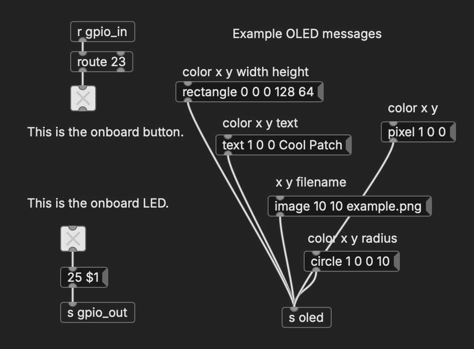

The idea with this is that you can load puredata patches, headless, that can interact with pi GPIO using simple messages.

Use CLI flags like this:

```
pipdloader -s -i 17,27,22 -o 5,6,13 MAIN.pd
```

The `-s` flag is "Use SSD1306 OLED on GPIO 2/3". You can send messages to `oled` that look like these:

```
text 0 0 0 Hello World - write text with color (0/1) at 0x0 pixel-position
rect 1 0 0 128 64 - make a rectangle with color (0/1)

```
The `-i` flag is "GPIO input" meaning your patch can receive `gpio_in` messages that look like `17 0` for "GPIO17 switched to off"

The `-o` flag is similar for output. Your patch can send `gpio_out` messages that look like  `5 0` for "turn off GPIO5".

Use green pins from [this pinout](https://pinout.xyz/).

Here is an example of a patch that you might use with this:



## building

You will need `cmake` and a compiler:

```
cmake -B build
cmake --build build
```

On an Intel mac, I did this all in a docker:

```
docker run --rm -ti -v `pwd`:/mnt --platform=linux/arm64 debian
cd /mnt
apt update
apt install -y build-essential git cmake libasound2-dev libjack-dev
cmake -B build
cmake --build build
```


## todo

I have some plans:

- option to trigger GUI (so you can edit patch)
- option to watch for file-changes & reload
- option/sends for [these nice rotary i2c things](https://www.adafruit.com/product/5752)
- options for PWM output
- support for MIDI (with automatic connect/disconnect)
- websocket server (to remotely interact with server)
- web emulator
